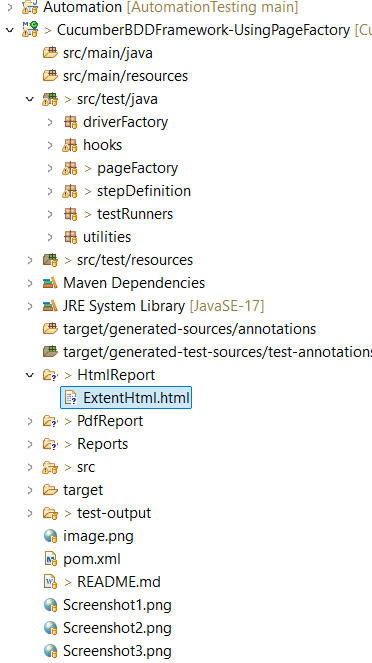
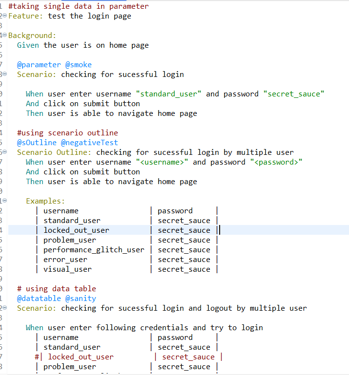
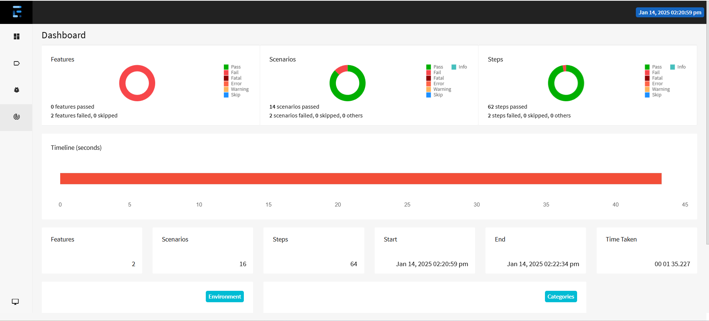
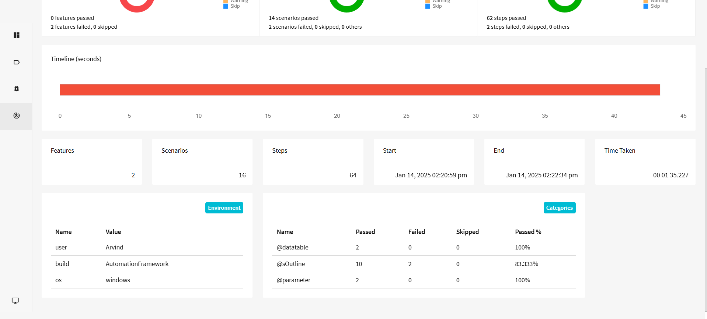

<h3 align="center">This is a BDD Framework Using Cucumber, TestNG, Selenium
</h3>
    Tools Used -
    Java, Selenium WebDriver, TestNG, Cucumber, Maven, Eclipse, Spark Extent Report
    In this framework I have used a demo web application to perform the login funtionality using three different ways-
    1. Passing username and password in parameter
    2. Passion multiple username and pasword using Secenario Outline.
    3. Testing Login using multiple credinetials passing through datatable.

    Also Test can be run parallel using the parallel = true in runner class.
    We can perform Cross browser testing using the Testng.xml in this framework.
    

 - 💞️ You are welcome to collaborate on this framework.

#### Screenshots

#### Folder structure

___
#### Feature file

___

#### html report

___

### Video Sample

#### Running Test in Chrome

[youtube video link -https://youtu.be/tV6beEmkrh4 ](https://youtu.be/tV6beEmkrh4)

