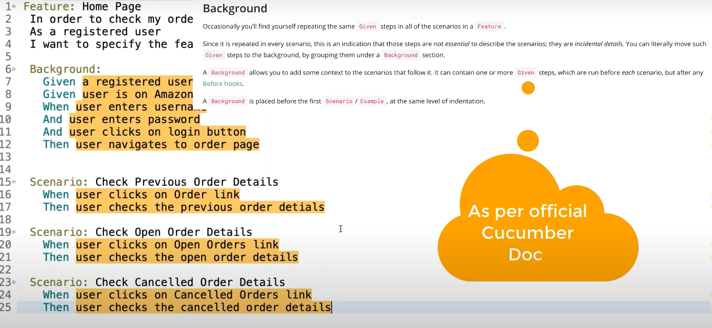

# This is a BDD Framework using Page factory class

###### page factory is extension of POM - it use @FindBy() anotation.

#### Screenshots

> Folder structure


___
> Feature file


___

> html report


___


### Video Sample

Running Test in Chrome


[youtube video link -https://youtu.be/tV6beEmkrh4 ](https://youtu.be/tV6beEmkrh4)

#steps 
#####1. create maven project in eclipse 


* `File> New > Maven Project `  
* `Check the text box Create a simple project(skipping the archetype); ` 
* `Group id - user website name i.e. com.arvind1  `
* `artifact id - project name i.e. CucumberBDDFramework-UsingPageFactory  `
* `version - 1.0  the project version as you wish`
* `Name - project name i.e. CucumberBDDFramework-UsingPageFactory`

<!-- to give above type format remove space at starting and add single tab -->

##### 2. add 4 main dependencies in pom.xml selenium-java, cucumber-java, cucumber-testng, testng

```
<dependency>
    <groupId>org.seleniumhq.selenium</groupId>
    <artifactId>selenium-java</artifactId>
    <version>4.25.0</version>
</dependency>


<dependency>
    <groupId>io.cucumber</groupId>
    <artifactId>cucumber-java</artifactId>
    <version>7.20.1</version>
</dependency>


<dependency>
    <groupId>io.cucumber</groupId>
    <artifactId>cucumber-testng</artifactId>
    <version>7.20.1</version>
</dependency>

<dependency>
    <groupId>org.testng</groupId>
    <artifactId>testng</artifactId>
    <version>7.10.2</version>
    <scope>test</scope>
</dependency>

<!-- get the webdriver by webdriver manager optional but recomented-->

<dependency>
        <groupId>io.github.bonigarcia</groupId>
        <artifactId>webdrivermanager</artifactId>
        <version>5.5.3</version> 
</dependency>
        
        
        
        
<!-- for reporting purpose optional-->

    <dependency>
        <groupId>com.aventstack</groupId>
        <artifactId>extentreports</artifactId>
        <version>5.1.2</version>
    </dependency>
    
   <dependency>
    <groupId>tech.grasshopper</groupId>
    <artifactId>extentreports-cucumber7-adapter</artifactId>
    <version>1.10.1</version>
</dependency>
```
##### if the default jar version is not compatible with the version of selenium then change the version of selenium jar in pom.xml
  
  ```  
    <properties>
    <project.build.sourceEncoding>UTF-8</project.build.sourceEncoding>
    <maven.compiler.release>17</maven.compiler.release>
  </properties>


```

##### 3. install cucumber and testng plugin from eclipse market place if not already installed

##### 4. create necessary folders  and packages
######    I. src/test/resource/ create a folder features- to store feature files for every feature in gerkin language i.e. 
```        
        Feature: test the login page

        Scenario: checking for sucessful login
            Given the user is on home page
            When user enter username and password
            And click on submit button
            Then user is able to navigate home page
            
```

###### if you want to pass multiple values the use senerio outline instead of senerio i.e. 

        Feature: test the login page
        Scenario Outline: checking for sucessful login
            Given the user is on home page
            When user enter username and password
            And click on submit button
            Then user is able to navigate home page
            Examples:
                | username | password |
                | abc      | 123      |
                | xyz      | 456      |

###### II. src/test/java/ create a package stepDefinition - to create step definition (glue) file for every feature

>[!NOTE]

> For easier way you can get step definition method implementation by right clicking on feature file and then Run As 	cucumber feature
or you can define method yourself as below

```    public class LoginPageForPageFactory {
	
	@Given("the user is on home page")
	public void the_user_is_on_home_page() {						
	    
	}

	@When("user enter username and password")
	public void user_enter_username_and_password() {
	    
	}

	@And("click on submit button")
	public void click_on_submit_button() {
		
	    
	}

	@Then("user is able to navigate home page")
	public void user_is_able_to_navigate_home_page() {
	 
	}
	
	@And ("close the browser")
	public void And_close_the_browser()
	
    }
```

	
	


###### III. src/test/java/ create a package pageFactory - to create page factory file for every feature here we define locater and methods
#######       a. for login page of the login feature create a class- LoginPageFactory.java

```
package pageFactory;

import org.openqa.selenium.WebDriver;
import org.openqa.selenium.WebElement;

import org.openqa.selenium.support.FindBy;
import org.openqa.selenium.support.PageFactory;

public class LoginpageFactory {

	WebDriver driver;
	// This line declares a reference variable driver of type WebDriver
	// To instantiate the WebDriver, you will need to create an instance of a
	// specific browser driver, such as ChromeDriver, FirefoxDriver, etc.

	// Initialize locators
	@FindBy(id = "user-name")
	WebElement username;

	@FindBy(id = "password")
	WebElement pswd;

	@FindBy(id = "login-button")
	WebElement loginBtn;

	// creating step methods
	public void enterUserName() {
		username.sendKeys("standard_user");
	}

	public void enterPassword() {
		pswd.sendKeys("secret_sauce");
	}

	public void ClickOnLogin() {
		loginBtn.click();
	}

//	creating constructor for initializing PageFactory and WebDriver
	public LoginpageFactory(WebDriver driver) {
		this.driver = driver;
		// to maintain the driver session

//		initialize page factory class
		PageFactory.initElements(driver, this);

//		optionally you can write the class name also i.e. PageFactory.initElements(driver, LoginpageFactory.java);
	}

} 

```

######    b. Scince the guidline of POM is to create different file for every page, so for home page we have to create HomePageFactory.java file

```
package pageFactory;

import org.openqa.selenium.WebDriver;
import org.openqa.selenium.WebElement;
import org.openqa.selenium.support.FindBy;
import org.openqa.selenium.support.PageFactory;

public class HomePageFactory {
	
	WebDriver driver;
	
	
	@FindBy(id="shopping_cart_container")
	WebElement cartLink;
	
	
	public void CheckCartLink()
	{
		cartLink.isDisplayed();
	}
	
	
	public void tearDown()
	{
		driver.close();
	}
	
	
	
	public HomePageFactory(WebDriver driver)
	{
		this.driver=driver;
		
		
		PageFactory.initElements(driver, this);
	}
	
}
```
###### c. Now the update methods in the stepDefinition class according to the PageFactory are as follows

```
package stepDefinition;

import io.cucumber.java.en.And;
import io.cucumber.java.en.Given;
import io.cucumber.java.en.Then;
import io.cucumber.java.en.When;
import pageFactory.HomePageFactory;
import pageFactory.LoginpageFactory;
import org.openqa.selenium.chrome.ChromeDriver;
import java.time.Duration;
import org.openqa.selenium.WebDriver;


public class LoginPageForPageFactory {
	
	static WebDriver driver;
	
								//	creating reference of LoginPageFactory class
	LoginpageFactory login;
								//	creating reference of HomePageFactory class
	HomePageFactory home;
	
	@Given("the user is on home page")
	public void the_user_is_on_home_page() {
								//	System.setProperty("webdriver.driver.chromedriver", "src/main/resources/chromedriver.exe") ;
								//		As of selenium 4.10.0 the driver manager is fully integrated, and will silently download drivers as needed. (Eg. On Mac/Linux, drivers are automatically downloaded to the ~/.cache/selenium
		
		driver =new ChromeDriver();
	    driver.manage().timeouts().implicitlyWait(Duration.ofSeconds(20));
	    driver.get("https://www.saucedemo.com/v1/");
	    
	    
	}

	@When("user enter username and password")
	public void user_enter_username_and_password() {
//		creating object of LoginPageFactory class by passing driver of this class in constructor 
		login=new LoginpageFactory(driver);
		login.enterUserName();
		login.enterPassword();
	    
	}

	@And("click on submit button")
	public void click_on_submit_button() {
		login.ClickOnLogin();
	    
	}

	@Then("user is able to navigate home page")
	public void user_is_able_to_navigate_home_page() {
		home=new HomePageFactory(driver);
		home.CheckCartLink();
		
		
	   
	}
	
	@And ("close the browser")
	public void And_close_the_browser()
	{
		home.tearDown();
	}
	
	

}


    III. create a package in src/test/java/testrunner - to store runner file 
    package testRunners;

import io.cucumber.testng.AbstractTestNGCucumberTests;
import io.cucumber.testng.CucumberOptions;

@CucumberOptions(
        tags = "@login",
        features = "src/test/resources/features/", // Path to your feature files
        glue = {"stepDefinition"},					
        plugin= {"pretty","html:target/htmlReport.html"})  // Package containing your step definitions
public class TestRunner extends AbstractTestNGCucumberTests{

}
```


##### 5. convert cucumber project by - right click on project folder> Configure> convert as cucumber project

    
  


> [!Common Mistakes]

>1.after static WebDriver driver;
again define WebDriver driver =new ChromeDriver(); instead of driver =new new ChromeDriver(); in a method 


#####hooks is not part of feature file but background is part of feature file and it should be there

> * Hook CAN BE WRITTEN IN STEP DEFINITION CLASS
OR CAN BE WRITTEN IN A SEPERATE COFIGURATION CLASS
setup and teardown
will be executed before each scenario — @Before
will be executed after each scenario — @After


> * we can have multiple same hooks and can set priority  
@Before
@Before
@After
@BeforeStep   	 before each step of the scenario
@AfterStep		— after each step of the scenario


> * we can annotate tag with hooks like @Before("@smoke")


> * To use hooks create a hooks package in src/test/java let and create class file let say - TestHooks.java
> * To maintain the session create the a static function to return the driver in hook class 

```
public static WebDriver getDriver()
	{
		return driver;
	}
	
	
and call it in the constractor of all factory classes as below in stepdefinition file
	
	LoginpageFactory login =new LoginpageFactory(TestHooks.getDriver());
```

> *	use hooks to implement only those this which is other than feature
	like setup browser
	maximize window
	pageloadtimeout
	Screenshot for fails test cases
	setup database etc  
	
	
	


##### sample of background and 


___


###changes in before this commit 
___

* created driver factory to initiate driver 
* created config package under src/test/rescouces and added config.properties
	write here , which browser you want to run , path etc. like - browser= chrome

* added utlities package under src//test/java and create a property reader to read data from perperties file


* created hooks for launch initialize, launch, close browser. and also created the implemented the Takescreenshot menthod to 	take screenshot of failed test.


###	before last commit resolve issue - external file downlaod disable 
> ->Preferences > Validation-> XML(wild web developer) > check


> added teestng.xml file to run parallel if require
added extent spark report generater
for that added extent.properties in src/test/resources
	
```	extent.reporter.spark.start=true
	extent.reporter.spark.out=Reports/Spark.html
 
	#PDF Report
	extent.reporter.pdf.start=true
	extent.reporter.pdf.out=PdfReport/ExtentPdf.pdf
 
	#HTML Report
	extent.reporter.html.start=true
	extent.reporter.html.out=HtmlReport/ExtentHtml.html
 
 
	#EXCEL Report 
	#extent.reporter.excel.start=true
	#extent.reporter.excel.out=ExcelReport/ExtentExecl.xlsx


	#FolderName
	basefolder.name=ExtentReports/SparkReport_
	basefolder.datetimepattern=d_MMM_YY HH_mm_ss
 
	#Screenshot
	screenshot.dir=/Screenshots/
	screenshot.rel.path=../Screenshots/
 
	#Base64
	extent.reporter.spark.base64imagesrc=true
 
	#System Info
	systeminfo.os=windows
	systeminfo.user=Arvind
	systeminfo.build=1.3
	systeminfo.build=AutomationFramework

```
> extent-config.xml

``` <?xml version="1.0" encoding="UTF-8"?>
<extentreports>
	<configuration>
		<!-- report theme -->

		<!-- standard, dark -->

		<theme>dark</theme>
		<!-- document encoding -->

		<!-- defaults to UTF-8 -->

		<encoding>UTF-8</encoding>
		<!-- protocol for script and stylesheets -->

		<!-- defaults to https -->

		<protocol>http</protocol>
		<!-- title of the document -->
		<documentTitle>Extent</documentTitle>
		<!-- report name - displayed at top-nav -->

		<reportName>Grasshopper Report</reportName>
		<!-- location of charts in the test view -->

		<!-- top, bottom -->

		<testViewChartLocation>bottom</testViewChartLocation>
		<!-- custom javascript -->

		<scripts>

<![CDATA[
$(document).ready(function() {
});
]]>
		</scripts>
		<!-- custom styles -->
		<styles>
<![CDATA[
]]>
		</styles>
	</configuration>
</extentreports>

```

>added dependency 

```<!-- for reporting purpose optional -->
    <dependency>
        <groupId>com.aventstack</groupId>
        <artifactId>extentreports</artifactId>
        <version>5.1.1</version>
    </dependency>
    
   <dependency>
    <groupId>tech.grasshopper</groupId>
    <artifactId>extentreports-cucumber7-adapter</artifactId>
    <version>1.14.0</version>
</dependency>
```


